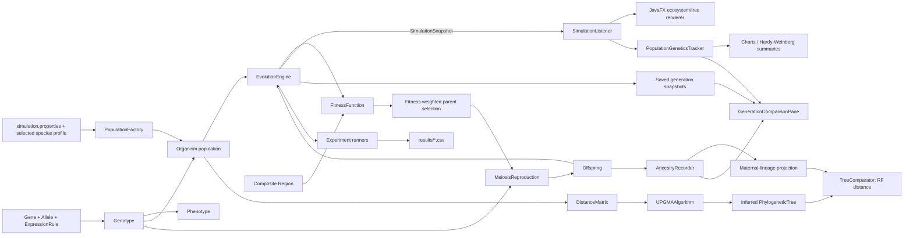

# System design architecture and data flow

## Component map

## Data flow

1. `SimulationConfig` loads validated run parameters. `SpeciesCatalog` loads 18 named animal and plant profiles from `config/species-catalog.csv`, grouped by kingdom and subcategory. The selected profile supplies a simplified trait-locus label (for example coat, plumage, scale pigment, or leaf pigment); `PopulationFactory` uses the configured seed and starting dark-allele frequency to create a diploid founder population.
2. `EvolutionEngine.step()` calculates terrain-match fitness, samples two distinct reproductively mature parents by weighted random selection, calls the `ReproductionStrategy`, increments the generation, records parent IDs, and replaces the population with adult offspring.
3. `EvolutionEngine` publishes a `SimulationSnapshot`. `MainApp` saves each snapshot by generation and schedules JavaFX updates on the application thread. The tabbed UI offers an ecosystem canvas, inferred tree/Newick view, statistics, and a generation comparison view.
4. `PopulationGeneticsTracker` computes per-locus allele frequencies, observed genotype ratios, H-W expectations, and deviation for each generation.
5. At analysis time, `DistanceMatrix.fromOrganisms` computes diploid Hamming distance. The minimum of the two allele alignments makes the metric independent of within-locus allele ordering. `UPGMAAlgorithm` performs average-linkage clustering and stores branch lengths in `PhylogeneticTree`.
6. `AncestryRecorder` preserves both parents for every birth. Since this is a reticulate pedigree, `maternalProjection` follows parent 1 only to create a strict tree. `TreeComparator` reports the Robinson–Foulds symmetric difference between that projection and UPGMA; parent 2 is intentionally omitted from this metric.
7. `experiment.Experiments` runs a mutation-rate sweep and two independent no-migration regional populations. `ExperimentReport` writes CSV summaries under `results/`.
8. `GenerationComparisonPane` selects a saved generation and compares it with the live generation using population summaries, selected individual genotypes, and the recorded two-parent family hierarchy. A selected historical generation can also be loaded into the visualization tabs without rewinding the simulation engine.

## Species profile scope

Animal and plant are selectable teaching profiles, not detailed organism simulators. All 18 catalog entries currently use the same diploid, sexually reproducing inheritance and terrain-match selection. The profile provides a display name, subcategory, scientific name, and simplified trait-locus label; it does not supply empirical genomes or species-specific life cycles. Haploidy, alternation of generations, pollination, self-fertilization, and plant physiology are not modeled. Catalog rows can be edited in `config/species-catalog.csv`.

## Main window layout

The maximized first tab is an overview dashboard: ecosystem and inferred tree share the upper row, and population statistics occupy the full lower row. The header keeps the species selector, live generation, historical generation picker, and run controls visible. The second tab contains historical population/genotype comparison and the recorded two-parent pedigree. It refreshes when opened to avoid spending work while hidden; pedigree expansion is explicitly user-triggered. `visualization/evolab.css` supplies the translucent glass-style colors, borders, and panel shadows; the ecosystem and tree canvases resize with their panels.

## Contracts and patterns

| Pattern | Project implementation | Responsibility |
|---|---|---|
| Strategy | `ExpressionRule`, `ReproductionStrategy`, `FitnessFunction`, `TreeBuildingAlgorithm`, `Behavior` | Select expression, reproduction, fitness, tree-building, or behavior rules through interfaces. |
| Composite | `Region` | Represent nested regions and their terrain/resource values. |
| Observer | `evolution.SimulationListener` and `SimulationSnapshot` | Publish generation state to analytics and visualization without putting UI code in the engine. |
| State | `LifeStage` | Control maturity and reproductive eligibility. |
| Command-style controls | `ExperimentController` | Run a requested number of generations and pause/resume/speed control. |
| Factory | `PopulationFactory` | Build repeatable diploid founder populations. |

## Interpretation boundary

The simulation stores both parent IDs, but tree-based RF comparison cannot represent a reticulate pedigree directly. All reported RF values are specifically against the parent-1 (maternal-lineage) projection and should not be presented as a comparison against the complete two-parent pedigree. A network method or declared consensus projection would be needed to include both parents.
